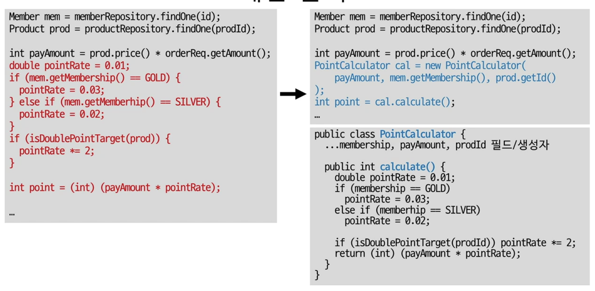

# 객체 지향 프로그래밍 입문(최범균)

## 상속과 재사용

상속을 통해 상위 클래스의 기능을 재사용할 수 있다. 즉, 확장하는 방법으로 활용할 수 있지만 중간 계층의 변경의 여파가 계층도를 따라 전파되기 때문에 문제가 발생할 수 있다.

### 상속을 통한 기능 재사용시 발생할 수 있는 단점

- 상위 클래스 변경이 어려움

  

    - 상위 클래스를 조금만 잘못 변경해도 모든 하위 클래스가 영향을 받는다.
    - 상위 클래스 입장에서는 앞으로 어떤 하위 클래스가 추가될 지 모르기 때문에 **하위 클래스가 많아 질수록 상위 클래스를 변경시키는 게 매우 어려워진다**.
    - 하위 클래스가 어느 정도 상위 클래스의 동작 방식을 알고 있어야 재사용이 가능해지기 때문에 이는 결과적으로 **상위 클래스는 하위 클래스에 대해 캡슐화가 약해**진다.
- 클래스가 불필요하게 증가

  

    - 상속을 통해 작성하면 새로운 요구사항이 추가될 때마다 그와 관련된 클래스가 불필요하게 많이 증가할 가능성이 높다.
- 상속 오용

    ```java
    //수하물 목록을 관리하는 클래스
    //Container 클래스는 ArrayList를 상속받아 구현
    public class Container extends ArrayList<Luggage> {
    	private int maxSize;
    	private in currentSize;
    	
    	public Container(int maxSize) {
    		this.maxSize = maxSize;
    	}
    
    	public void put(Luggage lug) throw NotEnoughSpaceException {
    		if (!canContain(lug)) throw new NotEnoughSpaceException();
    		super.add(lug);
    		currentSize += lug.size();
    	}
    
    	public void extract(Luggage lug) {
    		super.remove(lug);
    		this.currentSize -= lug.size();
    	}
    
    	public boolean canContain(Luggage lug) {
    		return maxSize >= currentSize + lug.size();
    	}
    	...
    }
    //Container 클래스는 put과 extract를 상위 클래스인 ArrayList의 add와 remove를
    //이용하여 구현하고 있다. 지금은 문제가 없어 보이지만 사용하면 문제가 발생할 가능성이 높다.
    ```

  

    - 이 상태에서는 add와 put 모두 수하물에 짐을 싫는 기능을 한다. 그렇지만 add의 경우에는 ArrayList의 메서드이기 때문에 실제 여부 Container에서 줄어들지 않는다. 즉, 짐은 쌓이지만 데이터가 반영이 안된다.
    - 상위 클래스의 기능을 상속받아 구현하는 경우에는 의도와는 다르게 기능을 오용할 수 있다.


### 상속의 단점 해결 방법 : 조립

<aside>
💡 **조립(Composition)**은 **여러 객체를 묶어서 더 복잡한 기능을 제공**하는 방식이다. 즉, **보통 필드로 다른 객체를 참조하는 방식으로 조립은 진행**된다. 혹은 객체를 필요 시점에 생성하거나 구한다.

</aside>

```java
public class FlowController {
	//Encryptor class에서 상속받아 만드는 것이 x
	//필요로 하는 객체에서 Encryptor객체를 생성하여 조립
	private Encryptor encryptor = new Encryptor(); 
	
	public void process() {
		//...
		byte[] encrytepdData = encryptor.encrypt(data);
		//...
	}
}
```

### 조립을 통한 기능의 재사용


- 조립을 통해 기능을 재사용하면 불필요한 클래스 수가 줄어든다.
- 여기서 만약 서명 기능을 하는 Signature 클래스를 추가하고 싶다면?
    - Storage 객체를 필드로 사용하여 Signature 클래스를 조립한다.
    - 이로 인해 Storage 클래스 내부를 변화하는 것도 훨씬 쉬워진다.
- 상속을 오용하는 문제도 해결할 수 있다.

    ```java
    public class Container {
    	private int maxSize;
    	private int currentSize;
    	//ArrayList 클래스를 상속하지 않고 필드로 사용하면 오용 문제 방지 가능
    	private List<Luggage> luggages = new ArrayList<>(); 
    	public Container(int maxSize){
    		this.maxSize = maxSize;
    	}
    	
    	//이제 Container 클래스는 add 기능을 제공하지 않는다.
    	public void put(Luggate lug) throws NotEnoughSpaceException {
    		if(!canContain(lug)) throw new NotEnoughSpaceException();
    		luggages.add(lug);
    		currentSize += lug.size();
    	}
    	
    	public void extract(Luggage lug){
    		luggages.remove(lug);
    		this.currentSize -= lug.size();
    	}
    	
    	public boolean canContain(Luggage lug){
    		return maxSize >= currentSize + lug.size();
    	}
    }
    ```

- 상속보다 조립을 사용하는 것이 보통 장점이 더 많다.
    - 따라서 상속하기에 앞서 조립으로 풀 수 없는지 검토한다.
    - 진짜 하위 타입인 경우에만 상속을 사용한다. 즉, 같은 종류의 기능을 수행하는 지 확인하고 아니라면 조립을 통해 구현한다.
    - 기능 재사용을 목적으로 진짜 하위 타입이 아님에도 불구하고 상속으로 구현하면 문제가 발생한다.

## 기능 분리


- 하나의 기능은 여러 하위 기능으로 분리할 수 있다.
- 예를 들어 암호 변경 기능을 생각하면
    - 암호 변경 기능을 위해서는 변경 대상을 확인하는 기능과 대상 암호를 변경하는 기능이 필요하다.
        - 변경 대상을 확인하는 기능을 위해서는 변경 대상을 구하는 기능과 대상이 없으면 오류 응답을 하는 기능이 필요하다.
        - 대상 암호 변경 기능도 마찬가지로 암호 일치 여부를 확인하는 기능과 암호 데이터를 변경하는 기능이 필요하다.
            - 암호 일치 여부를 확인하는 기능도 불일치하면 암호 불일치 응답을 하는 기능이 필요하다.
- 즉, 하나의 기능은 여러 하위 기능을 통해 역할을 수행한다고 볼 수 있다.
- 분리한 하위 기능을 누가 제공할 지 결정하는 것이 이것이 바로 객체지향 설계의 기본 과정이다.

### 기능 분리 과정


- 기능을 분리하고 각 객체에게 분리할 기능을 제공할 책임을 배분하는 것이다.
    - 예를 들어 암호 변경 전체 기능을 ChangePasswordService 객체에 할당하고, 변경 대상 구하는 기능은 MemberRepository에 할당하고, 대상 암호 변경은 Member 객체에 할당하는 형태로 책임을 분배할 수 있다.
- 하위 기능을 알맞은 객체에게 분배하는 식으로 객체지향 설계를 진행할 수 있다.
- 실제 코드를 보면 분리한 하위의 기능을 통해 전체의 기능을 구현한다.

    ```java
    //암호 불일치 응답 기능
    public class ChangePasswordService {
    	public Result changePassword(String id, String oldPw, String newPw) {
    		Member mem = memberRepository.findOne(id); //앞서 설명한 상속보다는 조립에 가까운 Member 객체 사용
    		if (mem == null) {
    			return Result.NO_MEMBER;
    		}
    		try {
    			mem.changePassword(oldPw, newPw);
    			return Result.SUCCESS;
    		catch (BadPasswordException ex) {
    			return Result.BAD_PASSWORD;
    		}
    	}
    	...
    }
    //실제 기능 구현을 보면 각각의 기능을 조립하는 형태로 거대한 하나의 기능이 수행되는 것을 확인할 수 있다.
    ```


### 큰 클래스, 큰 메서드


- 클래스가 크다는 의미는 소스 코드가 길다는 의미와 동일하다. 따라서 절차지향과 동일한 문제가 발생할 수 있다.
    - 클래스가 커질수록 많은 필드를 다양한 메서드가 공유를 하게 된다. 즉, 연결 정도(Coupling)가 심해지기 때문에 코드의 변경이 어려워진다.
    - 메서드가 커지면 많은 변수를 많은 코드가 공유를 하게 된다.
    - 즉, 이로 인해 여러 기능이 한 클래스나 메서드에 섞여 있을 가능성이 매우 높아진다. 즉, 점점 코드를 변경하기 어려운 구조로 바뀌게 된다.
- 책임에 따라 알맞게 코드 분리를 진행해야 한다.

## 책임 분배 방법

- **패턴 적용**
- **계산 기능 분리**
- **외부 연동 분리**
- **조건별 분기는 추상화**

### 패턴 적용

- 전형적인 역할 분리 패턴을 사용한다.
    - 간단한 웹의 경우는 컨트롤러, 서비스, DAO로 분리해서 볼 수 있다.
    - 도메인이 복잡한 경우에는 모델을 Entity, Value, Repository, DomainService로 분리해서 볼 수 있다.
    - 여러 기능에 공통으로 적용되는 기능은 Aspect를 사용해서 분리할수 있다.
    - 디자인 패턴 중 하나인 GoF로 정의된 패턴을 통해 기능을 분리할 수 있다.
        - Factory, Builder, Strategy, Template method, Proxy/Decorator Pattern 등이 존재

### 계산 분리



- 코드를 보면 빨간색 부분은 포인트를 계산하는 코드이다. 따라서 이 부분만 PointCalculator로 분리를 하면 자연스럽게 기능을 하위 객체로 분배할 수 있다.

### 외부 연동 분리


- 위의 코드처럼 네트워크, 메시징, 파일 등 외부 API와 연동된 기능을 RecommendService 객체로로 기능을 수행하면 자연스럽게 메인 코드에서 외부 연동 기능을 분리할 수 있다.

### 조건 분기(if~else)는 추상화


- if~else문을 추상화하여 공통 기능을 추상화하여 기능을 분리할 수 있다.
    - if문을 통해 수행되는 코드의 기능이 서로 유사한 경우에는 공통점을 추상화하여 기능을 분리할 수 있다. 이 경우에는 공통된 기능이 fileUrl을 구하는 것이고 이 기능을 통해 추상화가 진행되었다.
    - FileInfo라는 인터페이스를 통해 기존 local과 ss를 처리하는 if문에 추상화를 적용했다. 이로 인해 요구 사항에 fileInfo를 구현하는 콘크리트 클래스가 추가되더라도 추상화를 진행했기 때문에 코드 변경 없이 기능을 추가할 수 있다.

### 역할을 분리할 때 가장 중요한 점

- 가장 중요한 점은 이름을 잘 지어야 한다. 의도나 의미가 이름을 통해서 잘 드러나야 역할을 분리하기 쉽다.
    - 예를 들어 HTTP로 추천 데이터를 읽어오는 기능을 분리할 경우는 RecommendService라고 명명하면 HttpDataService하는 것보다 훨씬 더 그 의도가 잘 드러난다.
- **그 기능에 가장 잘 맞는 이름을 사용하는 것이 중요**하다.

### 역할 분리와 테스트


- 역할 분리가 잘 되면 테스트도 용이해 질 수 있다.
    - 왼쪽의 코드는 Point를 구하기 위해서는 Repository와 연동을 해야 원하는 포인트 계산 기능을 테스트할 수 있다.
    - 반면, 오른쪽 코드는 다른 class와 연동을 하지 않아도 포인트 계산 기능을 따로 테스트 해볼 수 있다.
- 역할을 잘 분리하게 되면 특정 일부 기능만 단위 테스트를 진행할 수 있다는 장점이 존재한다.

# 기능 분리 연습

## 예제 1 (계좌 이용 고객 클래스 기능 분리)

```java
public class CashClient {
	private SecretKeySpec keySpec;
	private IvParameterSpec ivSpec;

	//request를 통해 response를 반환하는 메서드
	private Res post(Req req) {
		String reqBody = toJson(req);

		//아래의 3줄은 암호화 기능을 제공
		Cipher cipher = Cipher.getInstance(DEFAULT_TRANSFORM);
		cipher.init(Cipher.ENCRYPT_MODE, keySpec, ivSpec);
		String encReqBody = new String(Base64.getEncoder().encode(cipher.doFinal(reqBody));

		//암호화한 결과를 어딘가에 전달을 하고 그 response를 responseEntity에 저장
		ResponseEntity<String> responseEntity = restTemplate.postForEntity(api, enReqBody, String.class);

		String encRespBody = responseEntity.getBody();

		//아래의 3줄은 응답으로 받은 값을 복화하는 기능을 제공
		Cipher cipher2 = Cipher.getInstance(DEFAULT_TRANSFORM);
		cipher2.init(Cipher.DECRYPT_MODE, keySpec, ivSpec);
		String respBody = new String(cipher.doFinal(Base64.getDecoder().decode(encReqBody));

		//복호화한 결과를 Object로 바꿔서 리턴을 해줌
		return jsonToObj(respBody);
	}
	...
}
```

### 내가 작성한 코드

```java
public class Encoder{
	public static String encoding(String req, SecretKeySpec keySpec, IvParameterSpec ivSpec) {
		Cipher cipher = Cipher.getInstance(DEFAULT_TRANSFORM);
		cipher.init(Cipher.ENCRYPT_MODE, keySpec, ivSpec);
		return new String(Base64.getEncoder().encode(cipher.doFinal(req));
	}
}

public class Decoder{
	public static String decoding(String encReqBody, SecretKeySpec keySpec, IvParameterSpec ivSpec) {
		Cipher cipher = Cipher.getInstance(DEFAULT_TRANSFORM);
		cipher.init(Cipher.DECRYPT_MODE, keySpec, ivSpec);
		return new String(cipher.doFinal(Base64.getDecoder().decode(encReqBody));
	}
}

public class CashClient{
	private SecretKeySpec keySpec;
	private IvParameterSpec ivSpec;

	private Res post(Req req) {
		String reqBody = toJson(req);
		Stirng encReqBody = Encoder.encoding(reqBody, keySpec, ivSpec);

		ResponseEntity<String> responseEntity = restTemplate.postForEntity(api, enReqBody, String.class);

		String encRespBody = responseEntity.getBody();

		String respBody = Decoder.decoding(encRespbody, keySpec, ivSpec);
		return jsonToObj(respBody);
	}
	...
}

//Encoder와 Decoder 2개의 객체로 분리했지만 중간의 모든 코드를 EncService 객체에서 
//Service 메서드로 하나로 묶어서 처리하면 더 좋을 것 같기도 하다.
```

나는 암호화 하는 3줄과 복호화하는 코드 3줄의 기능을 분리하고 싶다. 그래서 별개의 클래스 Encoder와 Decoder 클래스 2개를 생성하고 그 함수 내부에서 입력값을 기준으로 복호화와 암호화를 수행하는 방향으로 수정하려고 한다. 즉, 계산 기능을 분리하여 하위 기능으로 나눈다.

### 강사님의 코드

```java
//기존 코드에서 계산 기능을 분리함.
public class Cryptor {
	//내 코드와는 달리 keySpec과 ivSpec 모두 암복호화에 사용되기 때문에 내부 변수의 위치도 옮기셨다.
	private SecretKeySpec keySpec;
	private IvParamterSpec ivSpec;
	
	public String encrypt(String plain){
		Cipher cipher = Cipher.getInstance(DEFAULT_TRANSFORM);
		cipher.init(Cipher.ENCRYPT_MODE, keySpec, ivSpec);
		return new String(Base64.getEncoder().encode(chipher.doFinal(reqBody)));
	}

	public String decrypt(String encrypted){
		Cipher cipher = Cipher.getInstance(DEFAULT_TRANSFORM);
		cipher.init(Cipher.DECRYPT_MODE, keySpec, ivSpec);
		return new String(chipher.doFinal(Base64.getDecoder().decode(encRespBody)));
	}
	...
}

//기존 코드와 달리 Cryptor 클래스를 통해 하위 기능이 분리됨
public class CashClient {
	//필드에서 미리 선언하고 이를 조립하여 사용하는 방식! 상속보다 조립! 
	private Cryptor cryptor;

	private Res post(Req req){
		String reqBody = toJson(req);

		String encReqBody = cryptor.encrypt(reqBody);
		
		ResponseEntity<String> responseEntity = restTemplate.postForEntity(api, encReqBody, String.class);
		String encRespBody = responseEntity.getBody();
		
		String respBody = cryptor.decrypt(encRespBody);
	
		return jsonToObj(respBody);
	}
	...
}
//분리 자체는 동일하지만 강사님의 코드가 훨씬 효율적이다.
```

계산 기능을 분리하는 것은 동일했지만 resTemplate 부분에서 외부 연동 기능을 분리하는 것을 생각하지 못했다. 외부 연동 기능을 분리하는 코드는 작성하지 않으셨지만 이를 어떻게 처리할지 감은 잘 안잡힌다...

## 예제 2 (대여 클래스)

```java
public class Rental {
	private Movie movie;
	private int daysRented;

	//적립 포인트를 반환해주는 메서드
	public int getFrequentRenterPoints() {
		if (movie.getPriceCode() == Movie.NEW_RELEASE && daysRented > 1) 
			return 2;
		else
			return 1;
	}
	...
}

public class Movie {
	//개인적으로 final로 선언하는 것이 더 좋아보인다.
	public static int REGULAR = 0;
	public static int NEW_RELEASE = 1;
	private int priceCode;

	public int getPriceCode() {
		return priceCode;
	}
	...
}
```

### 내가 작성한 코드

```java
public class Rental {
	private Movie movie;
	private int daysRented;

	//적립 포인트를 반환해주는 메서드
	public int getFrequentRenterPoints() {
		return movie.getRentoerPoints(daysRented);
	}
	...
}

public class Movie {
	//개인적으로 final로 선언하는 것이 더 좋아보인다.
	public static int REGULAR = 0;
	public static int NEW_RELEASE = 1;
	private int priceCode;

	public int getPriceCode() {
		return priceCode;
	}
	public boolean getRenterPoints(int daysRented){
		if (this.priceCode == Movie.NEW_RELEASE && daysRented > 1) 
			return 2;
		else
			return 1;
	}
	...
}
//간단하게 계산 기능을 분리해서 분리를 구현했다.
```

### 강사님의 코드

```java
public class Rental {
	private Movie movie;
	private int daysRented;

	public int getFrequentRenterPoints(){
		return movie.getFrequentRenterPoints(daysRented);
	}

}

//이번에는 학실하게 하위 클래스가 맞고 기능이 동일하기 때문에 구현이 아닌 상속으로 작성
public abstract class Movie {
	public abstract int FrequentRenterPoints(int daysRented);
}

public class NewRelaseMovie extends Movie {
	public int FrequentRenterPoints(int daysRented){
		return daysRented > 1 ? 2 : 1;
	}
}

public class RegularMovie extends Movie {
	public int FrequentRenterPoints(int daysRented){
		return 1;
	}
}
```

If문의 조건 분기 또한 추상화를 진행해서 기능을 분리하셨다. 결국 포인트는 Movie를 하나의 추상 클래스로 보고 이를 기준으로 콘크리트 클래스를 작성하였더니 코드의 길이와 함께 Coupling도 감소했다.

## 예제 3 (기능을 하위로 할당하는 연습)

- 기능은 회원 가입 기능을 제공하는 객체
    - 사용자는 이메일, 이름, 암호를 입력해야 한다. 이 3가지 값은 모두 필수이다.
    - 암호가 다음 규칙을 통과하지 않으면 다시 입력해줘야 한다.
    - 같은 이메일로 가입한 회원이 있으면 다시 입력해줘야 한다.
    - 이메일 인증을 위한 메일을 발송하는 기능이 필요하다. 이 경우 유효성 검증을 위해 암호화된 토큰을 사용한다.
    - 이 모든 과정이 마무리되면 회원 가입은 완료된다.

### 나의 하위 기능 분리

- 최상위 객체는 회원 가입 기능을 제공하는 Singup 객체하다.
    - 이를 위해 사용자, 이름, 암호를 입력해야하는 객체 userInfo가 필요하다.
        - 3가지 정보를 각각 받는 객체가 필요하다. User, name, password 객체가 필요하다.
        - userInfo에는 3가지 값이 모두 입력되었는지 확인하는 userInfoChecker 객체가 필요하다.
        - 암호의 경우에는 규칙을 생성하는 makeRule 객체와 암호가 규칙을 통과했는지 확인하는 passwordChecker가 필요하다.
        - 같은 이메일로 가입된 회원을 체크하는 emailChecker 객체가 필요하다.
        - 똑같이 이메일 객체에는 인증 메일을 발송하는 객체인 EmailSendVerification 객체가 필요하다.
            - 인증 메일을 발송하는 객체에는 암호화 토큰을 제공하는 Token 객체가 필요하다
    - 이 모든 과정이 완료되면 회원 가입이 완료되면 완료 객체인 Completed가 필요하다.

### 강사님의 답변


- 회원 가입 기능을 크게 웹 요청과 회원 가입 2개의 객체로 분리했다.
    - 애초에 입력 값에 따라 필수값을 검증하는 것과 회원 가입을 처리하는 것은 웹 요청으로 분류할 수 있었는데 이를 인지 하지 못했다...
- 인증 메일 발송 안에 인증 메일을 전송하는 형태로 하위 기능을 분리하셨는데, 나는 단순하게 인증 메일 발송안에서 전송까지 처리하려고 별개로 보지 않았다.