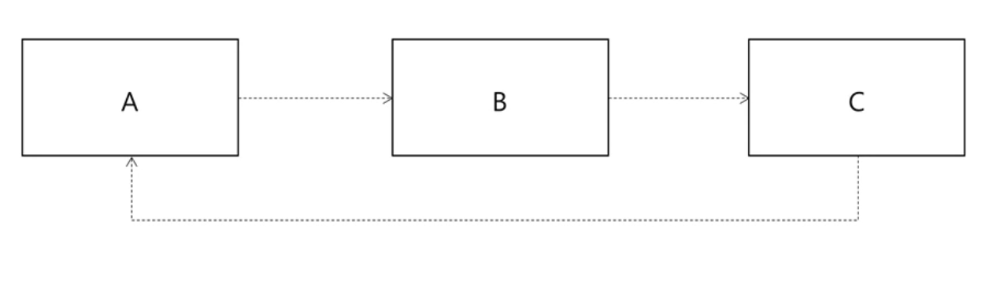
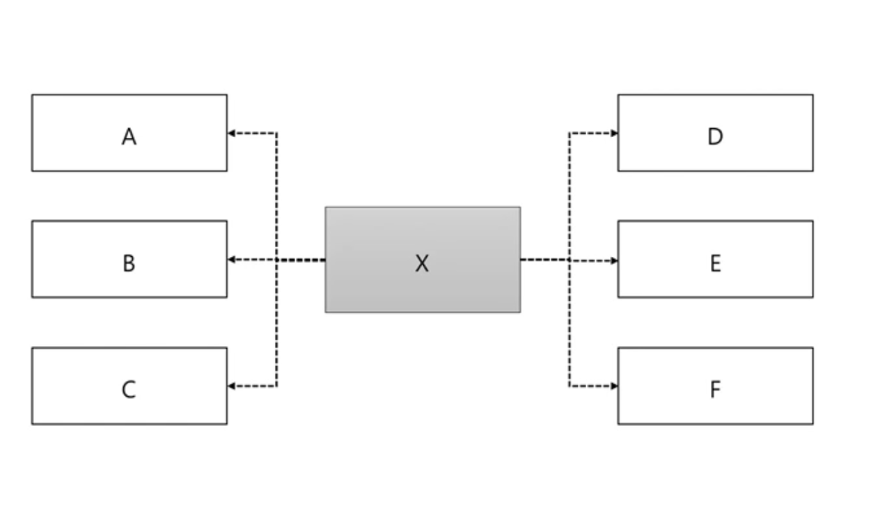
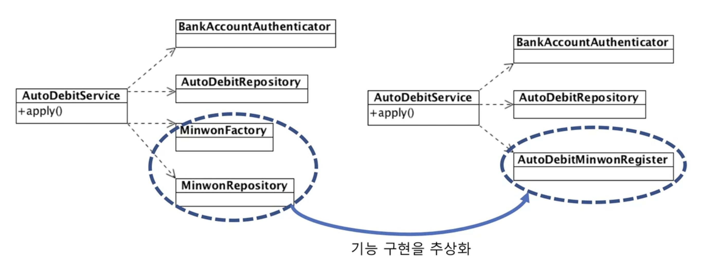
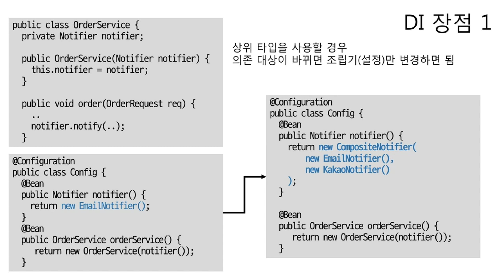
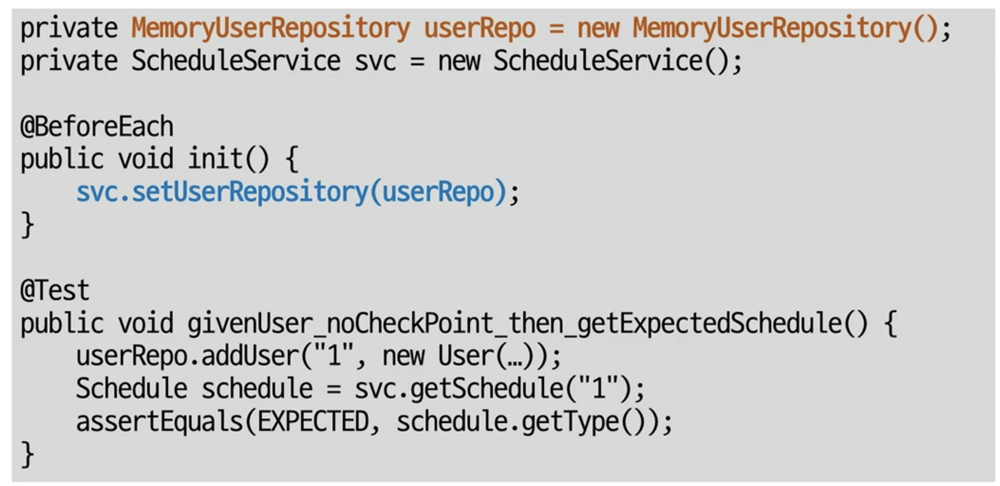

# 객체 지향 프로그래밍 입문(최범균)

## 의존

<aside>
💡 **의존**이란 **기능 구현을 위해 다른 구성 요소를 사용하는 것**을 말한다.

</aside>

- 객체를 생성하고 메서드를 호출하며 데이터를 사용하는 것 모두 의존의 예로 볼 수 있다.
- 의존은 변경의 전파와도 관계가 있다.
    - 내가 의존하는 대상이 바뀌면 나 자신도 바뀔 가능성이 높다.
    - 예를 들어 호출하는 메서드의 파라미터의 개수나 타입이 변경되거나 발생할 수 있는 익셉션 타입이 추가된다면 그 메서드를 사용하는 객체도 바뀔 가능성이 높다.

### 순환 의존

<aside>
💡 **순환 의존**이란 **여러 개의 객체가 순환하듯이 서로 의존하는 경우**를 말한다.

</aside>



- 순환 의존이 발생하면 한 객체의 변경이 연쇄적으로 전파될 가능성이 높다.
    - 예를 들어 A의 변경이 발생하면 C도 변경이 될 가능성이 높고, 그로 인해 C가 변경이 되면 그 여파로 B도 변경이 되고, A 자신도 B에 의해 변경이 될 수 있다.
- 클래스, 패키지 모듈 등 모든 수준에서 순환 의존이 없도록 설계를 해야한다.

### 의존하는 대상이 많다면?



- 의존하는 대상이 많을 수록 그 기능을 수행하는 객체는 변경이 많을 수 밖에 없다.
    - A~F까지 모든 객체에서 수정이 발생하면 이에 맞추어 X는 항상 수정이 발생할 수 밖에 없다.
- 즉, 의존하는 대상이 적을수록 좋다. 의존하는 대상이 적다면 그 기능을 호출하는 나 자신이 바뀔 가능성이 줄어든다.

## 의존하는 대상이 많을 때

### 한 클래스에서 많은 기능을 제공하는 경우

```java
//User Service 객체에서는 등록, 패스워드 변경, 유저 제한 등 다양한 기능을 수행함
public class UserService {
	public void regist(RegReq regReq) {
		...
	}

	public void changePw(ChangeReq chgReq) {
		...
	}

	public void blockUser(String id, String reason) {
		...
	}
//regist, changePw, blockUser 모두 의존하는 대상이 다르다
```

- 각 기능마다 의존하는 대상이 다를 수 있다. 즉, **한 기능의 변경이 다른 기능에 영향을 줄 수도 있다.**
    - 예를 들어 changePw의 기능을 수정하기 위해선 blockUser와 관련된 코드를 변경해야하는 상황이 발생할 수 있다.
    - 이 경우에는 한 메서드만 테스트하기 위해서 다른 메서드까지 초기화해야하는 상태가 발생할 수 있다. 즉, **단일 테스트가 어려워진다.**

### 개선 방법 1 : 기능 별로 분리

```java
//각 기능을 하나의 객체에서 수행하는 것보다 각 객체에서 수행하고 그 기능을
//조립하는 형태로 사용하면 의존성을 개선할 수 있다.

//사용자 등록기능을 수행하는 객체
public class UserRegist {
	public void regist(...) {
		...
	}
}

//비밀번호 변경 기능을 수행하는 객체
public class ChangePwService {
	public void changePw(...) {
		...
	}
} 

//계정 블럭 기능을 수행하는 객체
public class UserBlockService {
	public void blockUser(...) {
		...
	}
}
```

- **기능 별로 분리하는 것을 고려하면** 의존 대상이 줄어들 수 있다.
    - 기능 별로 분리하면 **클래스의 개수는 늘어나지만**, **각 클래스마다 필요로하는 의존이 줄어들고** 한 기능을 수정할 때 **다른 기능도 함께 수정할 필요가 없어진다.** 추가로 **개별 기능을 테스트하기 용이**해진다.

### 개선 방법 2 : 묶어보기



- **여러 기능을 단일 기능**으로 묶어볼 수 있는지 확인해보면 **의존 대상을 줄일 수 있다**.
    - 민원 등록을 위해 MinwonFactory와 MinwonRepository가 필요로 하다고 가정하면, 민원 등록 기능 구현을 추상화하면 AutoDebitMinwonRegister라는 클래스 하나로 민원 등록 기능을 수행할 수 있다. 즉, AutoDebitService가 의존하는 대상을 줄일 수 있다.

### 의존 대상 객체를 직접 생성하면?

- 의존 대상 객체를 직접 생성하는 경우에는 **생성 클래스가 바뀌면 의존하는 코드도 바뀔 수 있다.**
- **의존 대상 객체를 직접 생성하는 않는 방법**
    - 팩토리, 빌더
    - 의존 주입(**DI**, Dependency Injection)
    - 서비스 로케이터(Service Locator)


## 의존 주입

<aside>
💡 **의존 주입**이란 **외부에서 의존 객체를 주입하는 방식을 말한다**.

</aside>

```java
//스케쥴 서비스 기능을 수행하는 클래스
public class ScheduleService {
	private UserRepository repository;
	private Calculator cal;

	//생성자 방식으로 의존성을 주입
	public ScheduleService(UserRepository repository) {
		this.repository = repository;
	}
	
	//Setter 메서드 방식으로 의존성을 주입
	public void setCalculator(Calculator cal) {
		this.cal = cal;
	}
}

//초기화된 코드
UserRepository userRepo = new DbUserRepository();
Calculator cal = new Calculator();

ScheduleService schSvc = new ScheduleService(userRepo);
schSvc.setCalculator(cal);
```

- 생성자나 Setter 메서드를 통해 의존성을 주입한다.

### 조립기(Assembler)

<aside>
💡 **조립기**는 **객체의 생성, 의존성 주입을 처리**한다.

</aside>

```java
//대표적인 어셈블러가 스프링 프레임워크
@Configuration
public class Config {
	@Bean
	public ScheduleService scheduleSvc() {
		ScheduleService svc = new ScheduleService(repo());
		svc.setCalculator(expCal());
		return svc;
	}

	@Bean
	public UserRepository repo() {...}

	@Bean
	public Calculator expCal() {...}
}

//초기화
ctx = new AnnotationConfigApplicationContext(Config.class);

//사용할 객체 구함
ScheduleService svc = ctx.getBean(ScheduleService.class);

//사용
svc.getSchedule(..);
```

## DI의 장점

### 1. 의존대상이 바뀌어도 어셈블러만 변경하면 OK



- 의존대상이 바뀌면 조립 대상의 설정만 바꿔주면 된다.
    - 예를 들어 Notifier로 EmailNotifier를 사용하다가 CompositeNotifier로 변경을 해주고 싶다면 간단하게 **생성자(의존성 주입 방법)만 변경**시켜주면 된다. 즉, orderService 메서드는 변경할 필요가 없다.

### 2. 대역 객체를 사용해서 테스트 가능



- 의존하는 대상의 실제 구현이 없어도 대역 객체를 사용해서 테스트하기 쉽다.
    - 해당 코드에서 실제 DB 연동을 구현한 dbUserRepository가 없더라도 메모리를 통해 구현한 MemoryUserRepository를 이용해 스케줄 서비스를 테스트할 수 있다.
    - 즉, DB가 없어도 DB와 연동된 기능을 테스트할 수 있다.
- 원하는 대로 상태를 초기화할 수 있기 때문에 다양한 경우의 수를 테스트를 하기가 더 쉬워진다.

### DI를 습관처럼 사용하자!

프로그램을 조립하는 방법으로 가장 많이 사용하는 방식이 DI이다. 따라서 의존 객체는 외부에서 주입받도록 하는 방식으로 코드를 작성하는 습관을 들이자!