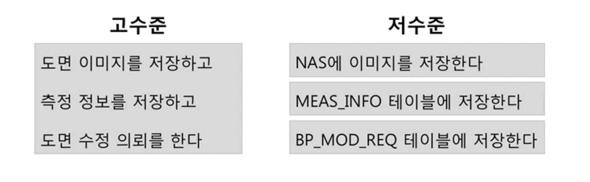
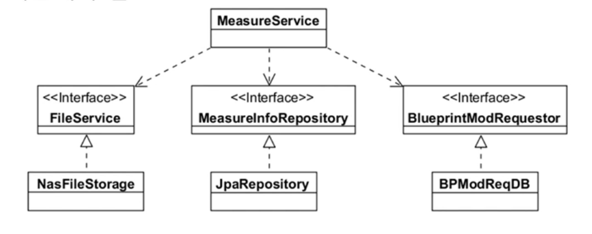
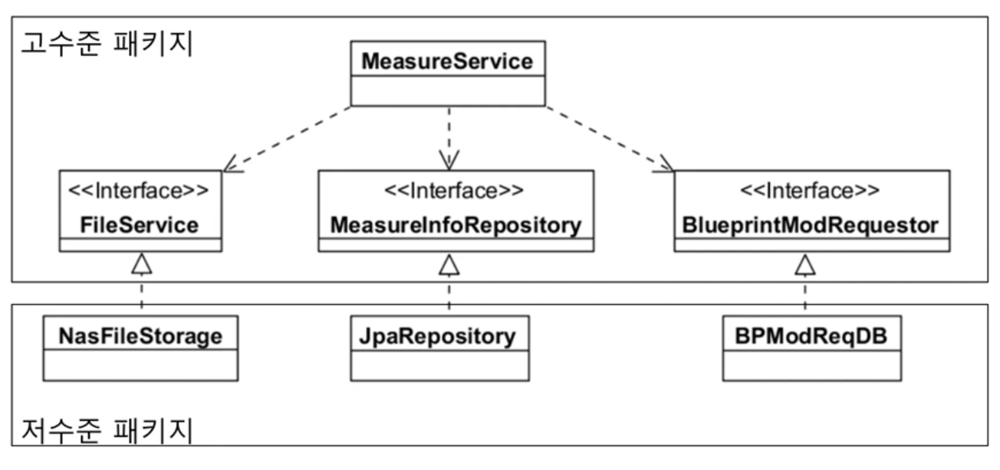
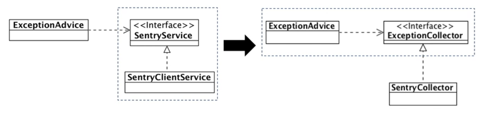
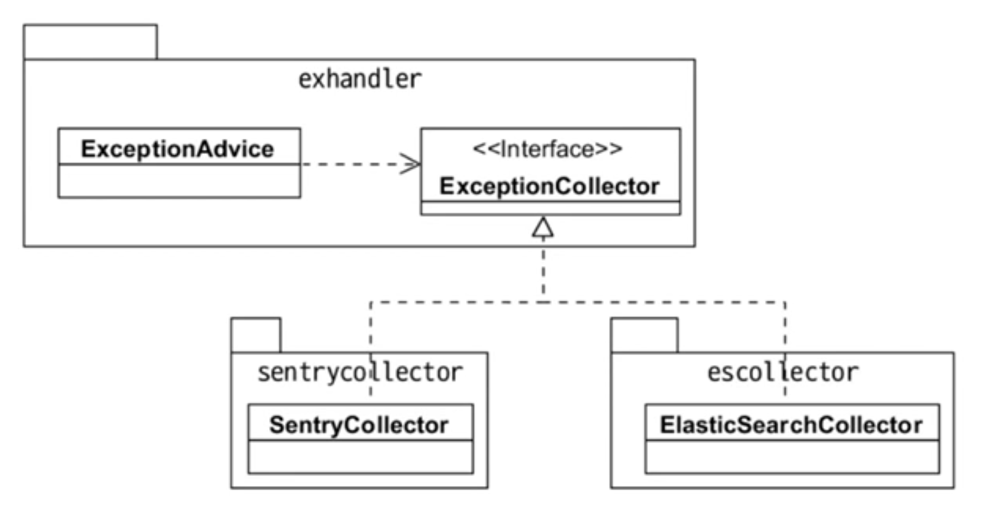
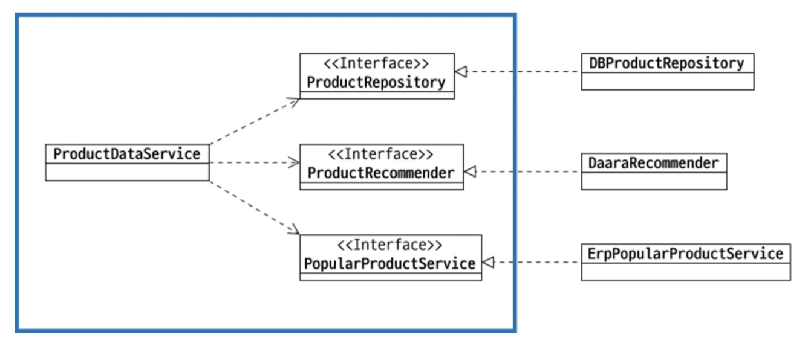

# 객체 지향 프로그래밍 입문(최범균)

## 모듈

<aside>
💡 **모듈**이란 **프로그램의 기능을 독립적인 부품으로 분리**한 것을 말한다. 일반적으로 서브루틴과 데이터 구조의 집합체로서, **그 자체로서 컴파일 가능한 단위**이며, **재사용** 가능하고 동시에 여러 다른 모듈의 개발에 사용될 수 있다.

</aside>

- 고수준 모듈이란 일반적으로 의미 있는 단일 기능을 제공하는 모듈을 말한다.
    - 상위 수준의 정책을 구현한다.
- 저수준 모듈이란 고수준 모듈의 기능을 구현하기 위해 필요한 하위 기능의 실제 구현을 담당한 모듈을 말한다.
- 예를 들어 수정한 도면 이미지를 NAS에 저장하고 측정 정보를 DB 테이블에 저장하고 수정 의뢰 정보를 DB에 저장하는 기능을 보면

  


### 고수준이 저수준에 직접 의존하면

```java
//Before 현재 고수준 모듈
public class MeasureService {
	public void measure(MeasureReq req) {
		File file = req.getFile();
		nasStorage.save(file);

		jdbcTemplate.update("insert into MEAS_INFO ...");

		jdbcTemplate.update("insert int BP_MOD_REQ ...");
	}
}

//After 저수준 모듈 기능 구현 방식 변경
public class MeasureService {
	public void measure(MeasureReq req) {
		File file = req.getFile();
		
		//도면 이미지를 nas대신 아마존의 s3에 저장하는 방식으로 변경
		s3storage.upload(file);

		jdbcTemplate.update("insert into MEAS_INFO ...");
		
		//도면 수정 의뢰를 DB가 아닌 rabitmq에 전달하는 방식으로 변경
		rabitmq.convertAndSend(...);
	}
}
//고수준 모듈의 정책이 바뀌지 않았음에도 저수준 모듈의 변경에 따라 고수준 모듈을
//변경해야 한다는 문제점이 발생한다.
```

- 저수준 모듈의 변경을 따라 고수준 모듈 또한 영향을 받는다.
    - 고수준 모듈의 정책이 바뀌지 않았음에도 저수준 구현 방식의 변경으로 고수준 모듈의 코드 변경이 발생했다.
- 즉, 의존성 역전의 원칙을 위배한다고 볼 수 있다.

### Dependency Inversion Principle(DIP)

<aside>
💡 **DIP**는 **의존성 역전의 원칙**을 말한다. 즉, **고수준 모듈**은 **저수준 모듈의 구현에 의존하면 안 된다는 원칙**을 말한다.

</aside>



- 저수준 모듈이 고수준 모듈에서 정의한 추상 타입에 의존해야 한다.
- 위를 기준으로 FileService, MeasureInfoRepository, BlueprintModRequestor 인테페이스 모두 고수준 모듈에 포함된 추상 타입이다.
    - 저수준 모듈은 이 추상 타입을 구현한 콘크리트 클래스를 말한다. 즉, NasFileStorage, JpaRepository, BPModReqDB 클래스들을 저수준 모듈이고, 고수준 모듈에 의존해야 한다.
- 고수준 모듈의 정책을 interface로 정의하고 이를 저수준 모듈이 상속받아 구현하는 형태로 개발한다면 저수준 모듈의 구현이 바뀌더라도 고수준 모듈의 변경이 최소화된다.

  


### 고수준 관점에서 추상화



- 고수준 입장에서 저수준 모듈을 추상화해야 한다.
    - 구현 입장에서 추상화하면 안된다.
    - 예를 들어 저수준 관점에서 추상화를 하게 되면 Sentry 관점에서 추상화가 진행되기 때문에 SentryService라는 interface를 도출할 수 있다.
    - 고수준 관점에서 추상화를 하게되면 Exception관점에서 추상화가 진행되기 때문에 ExceptionCollector라는 interface를 도출할 수 있다.
    - 즉, 같은 추상타입이지만 SentryService는 저수준 모듈의 구현에 가깝고, ExceptionCollector는 고수준 모듈의 정책에 가깝다.

### DIP의 장점

- DIP를 통해 유연함을 높일 수 있다.

  

    - 고수준 모듈의 변경을 최소화하면서 저수준 모듈의 변경 유연함을 높일 수 있다.
    - 기능 구현방식이 추가되어도 DIP 원칙을 맞추어 설계한다면 고수준 정책에 맞는 ElasticSearchCollector을 구현해주면 된다.

### 좋은 설계의 어려움

- 처음부터 바로 좋은 설계를 하는 것은 매우 어렵다.
    - 처음부터 DIP를 만족하는 설계가 바로 나오지는 않는다.
    - 요구사항이나 업무에 대한 이해가 높아지면 저수준 모듈을 인지할 수 있다. 이 후 상위 수준 관점에서 저수준 모듈에 대한 추상화를 시도한다.
    - 즉, exception이 발생하면 Sentry에 익셉션 정보를 전달하는 하위 모듈를 먼저 인지한 후에  exception이 발생하면 해당 정보를 모으는 기능을 수행하는 exceptionCollector 인터페이스로 추상화를 할 수 있다.

## 연습

### 상품 상세 정보와 상품 목록 기능 설계

- 상품 번호를 통해 상품 DB에서 상세 정보를 도출
- Darra API를 이용해서 추천 상품 5개를 구함
- 추천 상품이 5개 미만이면 같은 분류에 속한 상품 중 최근 한달 판매가 많은 상품을 ERP에서 구한 뒤 추천 상품을 5개를 채움

### 내 설계

- 상위 정책으로 상세 정보를 추출, API 호출, 정보를 보여줌으로 구분한다.
- 하위 모듈로 API 호출 기능을 상속받아 DarraAPI를 구현하고, 정보를 추출 기능을 상속받아 FindNoDB와 FindErp를 구현하고, 정보를 보여주는 기능을 상속받아 ViewDbInfo를 구현한다.

### 강사님 설계


- 왼쪽이 고수준 모듈, 오른쪽이 저수준 모듈이다.
    - API 호출 또한 추후 다른 API를 통해 상품을 구한다고 가정하면 API 호출 또한 상위 수준의 정책으로 볼 수 있지 않나 궁금하다.

### 설계의 결과



- ProductDataService라는 기능을 ProductRepository, ProductRecommender, PopularProductService라는 하위 기능(고수준 모듈)으로 분리하고, 그 하위 기능을 상속받아 구체화한 클래스(저수준 모듈)가 DBProductRepository, DaaraRecommendr, ErpPopularProductService가 된다.

## 결론

**DIP만 잘해도 좋은 설계를 할 가능성이 매우 높아진다.** 고수준과 저수준 모듈을 기준으로 추상화를 해보는 연습을 많이 해보자!