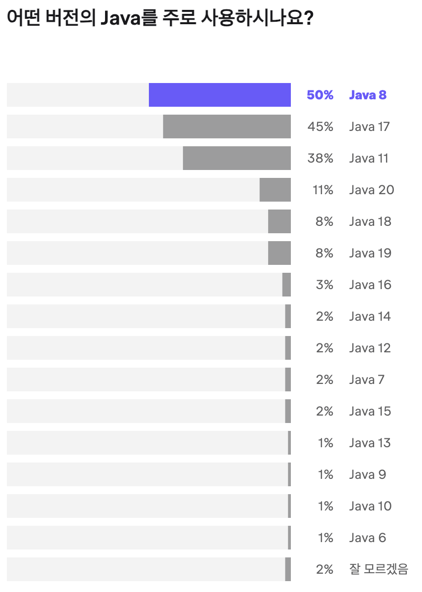
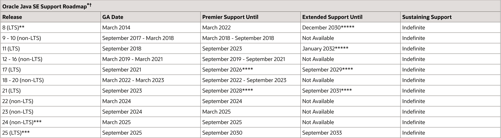

# Java 버전에 대하여(Java 8 → Java 21)

# Java SDK/JDK

- Java SDK(Software Development Kit)와 JDK(Java Development Kit)는 자바 프로그래밍 언어를 사용하여 소프트웨어를 개발하는 데 필요한 소프트웨어 도구들을 포함하는 패키지를 의미한다.
    - 대부분 동일한 의미로 사용되며, 주로 Java를 개발하고 실행하는 데 필요한 환경을 설치하는 데 사용한다.
- JDK는 Java 프로그램 개발에 필요한 도구와 실행 환경을 제공한다.
    - **JRE (Java Runtime Environment)**
        - Java 프로그램을 실행하기 위한 환경
        - JVM (Java Virtual Machine)과 Java 클래스 라이브러리가 포함되어 있다.
    - **javac**
        - Java 컴파일러로서, 자바 소스 코드를 바이트코드로 컴파일한다.
    - **jar**
        - 자바 애플리케이션을 패키징하는 도구
    - **javadoc**
        - 자바 API 문서를 생성하는 도구
    - 그 외 다양한 개발 도구를 제공한다.
- Java SDK는 대부분 JDK와 동일하지만 추가로 제공하는 확장 버전을 가리키는 데 사용하기도 한다.
    - 예시를 들면 Java EE SDK는 자바 엔터프라이즈 버전의 개발에 필요한 추가적인 라이브러리와 도구를 제공

## LTS

- LTS란 Long Term Support의 약자로, 오랜 기간 지원하는 특별한 버전의 에디션을 뜻한다.
    - LTS지원 버전은 출시 이후 8년간 보안 업데이트와 버그 수정이 지원된다.
    - 그리고 다음 LTS가 나오기 전까지 6개월 간격으로 non-LTS 버전이 출시된다. 주기가 짧은 이유는 그만큼 업데이트되는 양도 적고, 6개월 동안만 해당 버전을 지원하기 때문이다.
    - 결론적으로 Java SDK를 선택할 때 수 년 동안 모인 업데이트들을 토탈 지원하기 때문에 LTS인 버전이 주로 사용된다.
- 2023년 JetBrain에서 제공한 지표를 보면 아직도 Java 8의 사용량이 가장 높은 것을 확인할 수 있다.
    - 참조 링크: https://www.jetbrains.com/ko-kr/lp/devecosystem-2023/java/

  

- Oracle 로드 맵을 확인하면 LTS 지원 종료 시점을 확인할 수 있다.
    - 참조 링크: https://www.oracle.com/java/technologies/java-se-support-roadmap.html

  


## Java 8

- 2014년 출시된 [Java SDK](https://www.oracle.com/java/technologies/javase/8-whats-new.html)
    - 가장 오랜 기간 LTS를 유지했다는 특징을 가진다.
    - 오라클이 java를 인수한 후 첫 LTS 버전
    - 32비트를 지원하는 공식적인 마지막 버전
- 외부 개발 툴과의 연동성에서 가장 안정적이라는 특징이 존재한다.
    - Java 9 이상의 버전들은 모듈화도 도입 되었고, 가장 오랜 기간동안 릴리즈되는 과정에서 안정성이 확보되었기 때문이라고 생각한다
- Java 8부터 병렬 프로세스의 활용도가 높아 졌고, 그로 인해 기존 버전에서는 구현하기 힘들었던 부분을 함수형 프로그래밍과 비동기 논블로킹 방식을 도입되었다.
    - Java 11, Java 17은 Java 8를 베이스로 기능이 확장되었기 때문에 신규 Java 버전의 토대가 되는 버전으로 볼 수 있다.

### Java 8의 주요 변경 사항

- **람다 표현식(Lambda Expressions) 및 메서드 참조 방식**
    - 람다는 익명 함수를 표현하는 방법으로, 함수형 프로그래밍을 지원한다.

    ```java
    // Java 8 이전에는 익명 클래스 생성이 필요했다
    new Thread(new Runnable() {
        @Override
        public void run() {
            System.out.println("Running in a thread using anonymous class");
        }
    }).start();
    
    // 람다 표현식으로 간단하게 표현 가능
    new Thread(() -> System.out.println("Running in a thread using lambda expression")).start();
    
    // 메서드 참조 방식도 자바 8에서 도입
    new Thread(System.out::println);
    thread.start();
    ```

- **스트림 API(Stream API)**
    - 데이터를 함수형으로 처리할 수 있게 해주는 기능.
    - 스트림 API를 통해 병렬 처리 역시 효율적으로 작업할 수 있다.

    ```java
    List<Integer> numbers = Arrays.asList(1, 2, 3, 4, 5, 6, 7, 8, 9, 10);
    
    // 자바 8 이전에는 while이나 for 문을 통해 처리
    int sum = 0;
    for(int number : numbers) {
        sum += number;
    }
    System.out.println("Sum using for-each: " + sum);
    
    // Stream을 통해 간단하게 처리
    int streamSum = numbers.stream().mapToInt(Integer::intValue).sum();
    System.out.println("Sum using Stream API: " + streamSum);
    ```

- **날짜와 시간 API(java.time 패키지)**
    - Date와 Calendar의 문제를 해결한 LocalDate/LocalDateTime 클래스를 제공한다.

    ```java
    // 자바 8 이전에는 Date와 Calendar를 통해 날짜와 시간을 표현. 해당 클래스는 여러가지 이슈가 존재
    Date currentDate = new Date();
    System.out.println("Current date using java.util.Date: " + currentDate);
    
    // 포매팅이 필요한 경우에는 SimpleDateFormat를 사용
    SimpleDateFormat formatter = new SimpleDateFormat("yyyy-MM-dd HH:mm:ss");
    String formattedDate = formatter.format(currentDate);
    System.out.println("Formatted date using java.util.Date: " + formattedDate);
    
    Calendar calendar = Calendar.getInstance();
    System.out.println("Current date using java.util.Calendar: " + calendar.getTime());
    
    String formattedCalendarDate = formatter.format(calendar.getTime());
    System.out.println("Formatted date using java.util.Calendar: " + formattedCalendarDate);
    
    // LocalDate/LocalDateTime 클래스를 통해 기존 클래스 이슈 개선
    LocalDate date = LocalDate.now();
    System.out.println("Current date: " + date);
    
    LocalTime time = LocalTime.now();
    System.out.println("Current time: " + time);
    
    LocalDateTime dateTime = LocalDateTime.now();
    System.out.println("Current date and time: " + dateTime);
    
    // 포맷팅이 필요한 경우에는 DateTimeFormatter를 사용
    DateTimeFormatter newFormatter = DateTimeFormatter.ofPattern("yyyy-MM-dd HH:mm:ss");
    String formattedDateTime = dateTime.format(newFormatter);
    System.out.println("Formatted date and time: " + formattedDateTime);
    ```

- **디폴트 메서드(Default Method)**
    - 기존 인터페이스 메서드와 달리 `default` 키워드로 시작하는 기본 구현체가 존재하는 인터페이스 메서드

    ```java
    public interface Vehicle {
        // 일반적인 인터페이스 메서드 정의
        double getMilesPerGallon();
    
        // 디폴트 메서드
        default double getKilometersPerLiter() {
            double milesPerKm = 1.609;
            double gallonsPerLiter = 0.264;
            return getMilesPerGallon() * (milesPerKm / gallonsPerLiter);
        }
    ```

- **Optional**
    - NPE를 방지하고자 인스턴스를 감싸는 용도로 사용하는 컨테이너 클래스

    ```java
    // 비어있는 Optional 값. null과는 다르다
    Optional<String> empty = Optional.empty();
    
    // null이 아닌 Optional 객체 값 생성
    Optional<String> value = Optional.of("hello");
    System.out.println(value.isPresent()); 
    
    // null 값을 가질 수 있는 Optional 객체 값 생성
    String nullableString = null;
            Optional<String> nullableValue = Optional.ofNullable(nullableString);
    
    ```


### Java 8을 가장 많이 사용하는 이유

- 람다 표현식, Stream API, Optional 클래스 등 중요한 업데이트와 변화를 도입했던 점이 가장 컸다
- Java11과 크게 차이가 나지 않는 점도 컸다
    - java11부터 요금정책이 바뀌어서 Oracle JDK 말고 Open JDK를 사용해야 한다는 단점이 있다.

## Java 11

- Oracle JDK와 Open JDK 통합되고 Oracle JDK가 구독형 유료 모델로 전환된 [Java SDK](https://www.oracle.com/java/technologies/javase/11-relnote-issues.html)
- G1 GC가 기본 GC로 설정되었다.
    - G1 GC란 Garbage-First GC로 메모리를 여러개의 독립적인 영역으로 나누고, GC 시에는 사용되지 않는 영역(즉, 가비지가 가장 많은 영역)부터 수집하는 방식으로 동작한다.
    - 이로 인해 GC 중지 시간을 줄이고, 메모리 사용 효율을 높이는 효과를 얻을 수 있다.
    - Java 8의 기본 가비지 콜렉터는 Parallel GC이다. 멀티 스레드를 이용하여 병렬로 가비지 콜렉션을 수행한다는 특징이 존재한다
- Java 8과 Java 11의 차이점은 존재하지만 주요 언어 기능에서 큰 변화는 없다.
    - 그렇기에 Java 8에서  버전업을 고려하면 Java 17이나 Java 21이 권장된다!

### Java 8 → Java 11의 주요 변경 사항

- **Epsilon 가비지 콜렉터**
    - 새로운 유형의 가비지 콜렉터로 개발 테스트를 위해 제공한다.
    - 이를 통해 JVM의 성능을 측정하고 튜닝할 수 있지만 실제 어플리케이션에서의 사용은 권장하지 않는다.
- **HTTP 클라이언트 API**
    - Http Client API가 새롭게 Java 표준 라이브러리에 추가되었다.
    - HTTP 클라이언트 API는 HTTP/1.1과 HTTP/2를 모두 지원하고, 동기 및 비동기 프로그래밍 모델 역시 지원한다.

    ```java
    var request = HttpRequest.newBuilder()
               .uri(new URI("http://www.example.org"))
               .build();
    var client = HttpClient.newHttpClient();
    var response = client.send(request, BodyHandlers.ofString());
    System.out.println(response.body());
    ```

- **var 키워드 확장**
    - 자바 10의 로컬-변수 타입 추론이 람다 매개변수에도 도입되었다.
    - var을 통해 개발자가 지역 변수 선언 시 변수의 데이터 유형을 명시적으로 선언하지 않아도 된다.
        - 즉, 로컬 변수에만 사용하고 필드 변수에서는 사용할 수 없다
    - 그렇지만 **초기값이 주어져야 컴파일러가 해당 변수의 데이터 유형을 추론할 수 있다!**

    ```java
    // Java 10 이전 버전에서 타입 지정은 필수
    ArrayList<String> list = new ArrayList<>();
    Stream<String> stream = list.stream();
    
    // Java 10 부터는 로컬 변수의 타입에 var을 사용
    var list = new ArrayList<String>();  
    var stream = list.stream(); 
    
    // 초기 값이 필요하기에 null은 사용할 수 없다. 예외가 발생함
    var person = null;
    ```

- **String 메서드 추가**
    - `strip()`, `isBlank()`, `lines()`, `repeat()` 등의 새로운 메소드들이 추가되었다.

    ```java
    String str = "  Hello, Assistant!   ";
    
    // 문자열의 앞, 뒤에 존재하는 공백 제거 메서드. "Hello, Assistant!" 출력
    System.out.println(str.strip());   
    
    String str2 = "  ";
    
    // 띄어쓰기를 포함하여 빈 갚 여부를 판단하는 메서드. true를 반환
    System.out.println(str2.isBlank()); 
    
    // 줄바꿈(\n)을 기준으로 나누는 메서드. Hello -> Assistant -> How are you? 출력됨
    String str3 = "Hello\nAssistant\nHow are you?";
    str3.lines().forEach(System.out::println);
    
    String str4 = "echo ";
    
    // 해당 문자열을 반복하는 메서드. echo echo echo 출력
    System.out.println(str4.repeat(3));  
    ```

- **람다 내 로컬 변수 문법 추가**
    - Java 10에서 도입된 var을 Lambda 표현식 매개 변수에서도 사용될 수 있게 되었다.

    ```java
    BiPredicate<Integer, Integer> isSameNumber = (var x, var y) -> x.intValue() == y.intValue();
    ```

- **Collection 메서드 추가**
    - Java 9에서는 불변 List, Set, Map의 인스턴스를 간편하게 생성할 수 있는 팩토리 메서드인 List.of, Set.of, Map.of가 추가되었다.

    ```java
    // 불변 인스턴스 생성. 추가가 불가능함을 명심해야 한다.
    List<String> immutableList = List.of("Hello", "World");
    Map<String, Integer> immutableMap = Map.of("One", 1, "Two", 2);
    Set<String> immutableSet = Set.of("Hello", "World");
    ```

- **Stream API 메서드 추가**
    - Java 8에서 Java 11로 올라가면 `Stream.iterate()`, `Optional.stream()`과 같은 신규 메서드가 추가되었다.

    ```java
    // Stream.iterate 메소드는 중단 조건을 첫 번째 인수로 사용할 수 있다.
    Stream.iterate(1, i -> i <= 10 , i -> i + 1)
          .forEach(System.out::println); 
          
    // Optional을 Stream으로 변환할 수 있다!
    Optional<String> optional = Optional.of("foo");
    List<String> list = optional.stream().collect(Collectors.toList());
    ```

- **Try-With-Resources 개선**
    - Java 9 이후에는 `try` 블럭 밖에서 선언한 변수를 가져와 사용할 수 있다.

    ```java
    // Java 9 이전
    void tryWithResourcesBeforeJava9() throws IOException {
        BufferedReader reader1 = new BufferedReader(new FileReader("test.txt"));
        try (BufferedReader reader2 = reader1) {
            ...
        }
    }
    
    // Java 9부터는 try 블럭 안에서 생성하지 않아도 된다!
    void tryWithResourcesByJava9() throws IOException {
        BufferedReader reader = new BufferedReader(new FileReader("test.txt"));
    try (reader) {
            ...
        }
    }
    ```


## Java 17

- 2021년 9월에 출시된 [Java SDK](https://www.oracle.com/java/technologies/javase/17-relnote-issues.html)
    - Java 11과 비교하여 70가지 이상의 JEP가 더 추가되었다.
- 대부분의 회사에서 Java 8에서 버전업을 할 때 높은 확률로 버전업 타겟이 되는 버전이다.
    - Spring Boot 3.0부터는 JDK 17이상을 지원하고 있다는 점이 가장 크다고 느껴졌다
    - 또한 바로 최신 버전(**Java 21 이상**)으로 전환하는 것 보다 좀 더 검증된 17 버전이 안전하다고 생각이 들었기 때문에 주로 선택되는 것 같다

### Java 11 → Java 17의 주요 변경 사항

- **Switch 표현 개선**
    - **Java 12(표준화는 Java 14)**부터 Switch문 값 직접 반환하는 방식과 람다식 등과 같은 간결한 switch 표현식이 도입되어 코드를 더 간결하게 작성할 수 있다

    ```java
    DayOfWeek day = DayOfWeek.FRIDAY;
    
    // Case문 람다식 및 직접 반환에 대한 예시 코드
    String typeOfDay = switch (day) {
        case MONDAY, TUESDAY, WEDNESDAY, THURSDAY, FRIDAY -> "Workday";
        case SATURDAY, SUNDAY -> "Weekend";
    };
    ```

- **Text Blocks 방식**
    - Java 13(표준화는 Java 15)에서 도입된 Text Blocks을 통해 가독성 좋고, 편하게 문자열을 작성할 수 있다.
    - Text Block은 **“”” {문자열 } “””** 의 형태로 작성하면 된다!

    ```java
    String text = """
                  Hello,
                  Java 13!
                  """;
                  
    // format Method나 + 를 통해 동적으로 값을 주입받아 사용할 수 도 있다!
    String name = "John Doe";
    int age = 30;
    String city = "New York";
    
    String text = """
                  Hello, my name is %s.
                  I am %d years old.
                  I live in %s.
                  """.formatted(name, age, city);          
    ```

- **instanceof 내 패턴 매칭 기능**
    - Java 14에서는 instanceof 연산자와 함께 패턴 매칭을 사용하여 명시적인 형변환 없이 값에 접근할 수 있게 되었다.

    ```java
    Object obj = "Hello";
    
    // Java 14 이전 버전에는 형변환이 필요했다
    if (obj instanceof String) {
        String str = (String) obj;
        System.out.println(str.length()); 
    }
    
    // Java 14 이후 버전에는 명시적인 형변환 대신 instanceof에서 타겟이 되는 타입에 접근할 수 있다!
    if (obj instanceof String str2) {
        System.out.println(str2.length());
    }
    ```

- **Records 구조**
    - record 선언을 통해 데이터 전달 객체를 간결하게 표현할 수 있다
        - `getter`와 `equals`, `hashCode`, `toString` 메소드를 자동으로 생성해준다!
    - Immutable 객체이기 때문에 모든 값은 생성자를 통해 설정되어야 한다는 제약이 존재한다.
    - 또한, 모든 필드가 private final로 선언되기 때문에 record로 선언된 클래스는 상속이 불가하다

    ```java
    // public class로 작성하듯이 record 키워드로 선언하면 필요한 메서드들이 자동으로 생성된다!
    public record User(String name, int age) {}
    ```

- **Sealed Classes**
    - Java 15(표준화는 Java 17)부터 Sealed Class를 통해 클래스 또는 인터페이스가 상속이나 구현이 가능한 다른 타입들을 제한할 수 있다

    ```java
    // sealed로 선언되어 있기에 그 외에 클래스에서 상속이 불가능하다
    public sealed abstract class Shape 
        permits Circle, Rectangle {
    }
    
    public class Circle extends Shape {
        // ...
    }
    
    public class Rectangle extends Shape {
        // ...
    }
    
    // 그 외의 클래스가 상속하는 경우에는 Compile 에러가 발생한다!
    public class Triangle extends Shape {
        // ...
    }
    ```

- **Stream API 활용한 결과 반환**
    - Java 17버전부터 Collectors.toList() 대신 Stream API를 통해 결과를 반환할 수 있다!

    ```java
    // Collectors.toList() 대신 Stream 메서드를 통해 결과를 반환
    List<Integer> list = IntStream.rangeClosed(0, 10)
                                    .filter(n -> n % 2 == 0)
                                    .boxed()
                                    .toList();
    ```


## Java 21

- 2023년 9월 19일에 출시된 [Java SDK](https://www.oracle.com/java/technologies/javase/21-relnote-issues.html)
- Spring Boot 기준으로 3.2부터 지원한다

### Java 17 → Java 21의 주요 변경 사항

- **가상 쓰레드(Virtual Thread) 추가**
    - Java 19에 Preview로 도입된 가상 쓰레드가 Java 21 버전에서 표준화되었다.
    - 기존 플랫폼 쓰레드(캐리어 쓰레드)와 달리 JVM 자체적으로 내부 스케줄링을 통해서 사용할 수 있는 경량의 쓰레드를 제공한다
        - JVM에서 직접 쓰레드를 생성하고 크기도 조절되기에 기존처럼 쓰레드 풀을 신경쓰지 않아도 된다는 장점이 있다.
        - BaseVirtualThread는 Thread 클래스를 상속받기 때문에 기존 코드와도 호환된다.
    - [가상 쓰레드 참고 링크](https://findstar.pe.kr/2023/04/17/java-virtual-threads-1/)

    ```java
    public class VirtualThreadsExample {
        public static void main(String[] args) throws InterruptedException {
            // 가상 쓰레드 생성
            try (var executor = Executors.newVirtualThreadPerTaskExecutor()) {
                for (int i = 0; i < 10; i++) {
                    executor.submit(() -> {
                        System.out.println("Thread: " + Thread.currentThread());
                    });
                }
            }
        }
    }
    
    // 예외 전파
    executor.throwIfFailed(e -> new RuntimeException("ERROR_MESSAGE"));
    
    // 종료 시간 설정
    executor.joinUntil(Instant.now().plusSeconds(1));
    ```

- **패턴 매칭 개선**
    - 패턴 매칭이 `switch` 문과 함께 더 강력하게 개선되었다.

    ```java
    public class PatternMatchingExample {
    		// 패턴 매칭 및 람다 형태의 switch 문을 작성하여 편하게 타입 처리를 할 수 있다
        static String formatShape(Object shape) {
            return switch (shape) {
                case String s && s.length() > 5 -> "Long string: " + s;
                case Integer i -> "Integer: " + i;
                case null -> "Null value";
                default -> "Unknown type";
            };
        }
    
        public static void main(String[] args) {
            System.out.println(formatShape("Hello World"))
            System.out.println(formatShape(42));
        }
    }
    ```

- **간소화된 문자열 템플릿**
    - 문자열 템플릿은 Java 21에서 추가된 기능으로 문자열에 동적으로 값을 삽입하는 것을 간소화한다.

    ```java
    public class StringTemplatesExample {
        public static void main(String[] args) {
            int age = 25;
            String name = "Alice";
            // STR 접두사를 사용해 런타임에 동적으로 문자열을 구성
            String message = STR."My name is \{name} and I am \{age} years old.";
            
            // My name is Alice and I am 25 years old.이 출력된다.
            System.out.println(message); 
        }
    }
    ```

- **Sequenced Collections**
    - 컬렉션 API가 강화되어 정렬된 컬렉션을 더 쉽게 다룰 수 있다.
        - 정의된 만남 순서로 컬렉션을 나타내는 새로운 인터페이스를 도입되어 편해졌다.

    ```java
    interface SequencedCollection<E> extends Collection<E> {
        // 역순으로 처리하는 공통된 메서드를 제공
        SequencedCollection<E> reversed();
    
        // 첫 번째와 마지막 요소를 접근하는 메서드 제공. Deque에서 승격되었다.
        void addFirst(E);
        void addLast(E);
        E getFirst();
        E getLast();
        E removeFirst();
        E removeLast();
    }
    ===================================================================
    
    public class SequencedCollectionsExample {
        public static void main(String[] args) {
            SequencedSet<String> set = SequencedCollections.set();
            set.add("First");
            set.add("Second");
    
    				// First 출력
            System.out.println(set.first()); 
            // Second 출력
            System.out.println(set.last());
        }
    }
    ```

- **Unnamed Patterns and Variables/Unnamed Classes and Instance Main Methods**
    - 구성 요소의 이름이나 유형을 명시하지 않고 **이름 없는 패턴 및 변수로, 밑줄 문자(`_`)로 표시**한다.
    - 또한, 처음 시작하는 사용자들이 편하게 사용할 수 있도록 이름 없는 클래스나 메인 메서드를 제공한다.
        - 위 기능들을 Preview로 제공되었다.

    ```java
    // public static void main 및 클래스 없이 사용할 수 있음
    void main() {
        System.out.println("Hello, World!");
    }
    
    // 이름이나 유형을 명시하지 않지 않고 처리 
    int totalCount = 0;
    for (Member _ : members) {
        if (totalCount < LIMIT) { 
            ... 
    				totalCount++ 
    				...
        }
    }
    ```


## 참고 자료

- [ttps://medium.com/javarevisited/java-8-9-11-and-17-what-you-need-to-know-about-the-key-differences-between-these-versions-808dfee652ba](https://medium.com/javarevisited/java-8-9-11-and-17-what-you-need-to-know-about-the-key-differences-between-these-versions-808dfee652ba)
- https://openjdk.org/projects/jdk/21/
- https://mangkyu.tistory.com/308